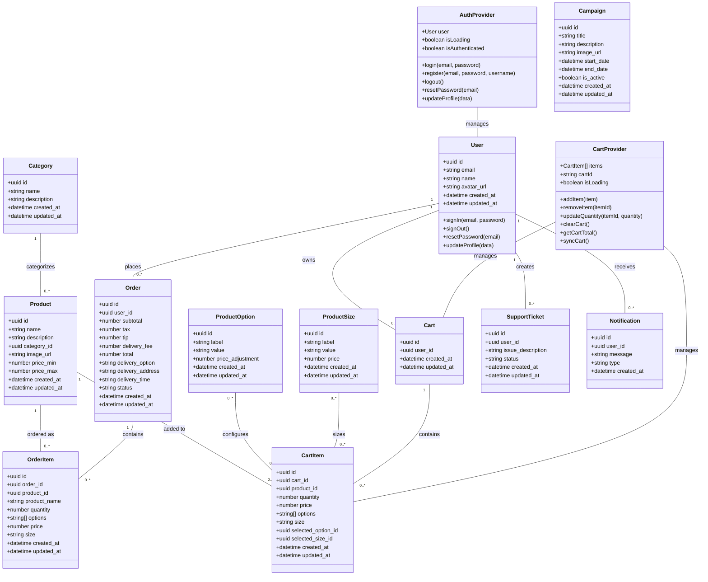

# Enhanced Class Diagram

## Notes
- This enhanced class diagram shows more detailed relationships between classes
- Attributes include database column types
- Methods represent key functionality in each class
- Relationships show cardinality (one-to-many, many-to-many, etc.)
- Provider classes represent React context providers that manage state
