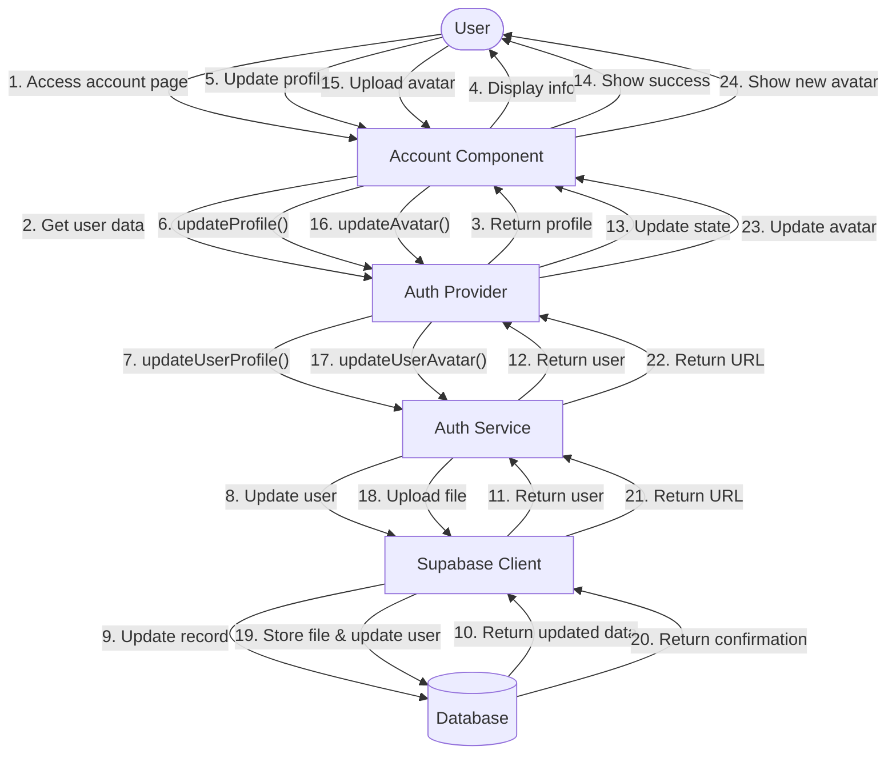

# Account Management Collaboration Diagram

```mermaid
graph TD
    User([User]) -- "1. Access account page" --> AccountUI[Account Component]
    AccountUI -- "2. Get user data" --> AuthProvider[Auth Provider]
    AuthProvider -- "3. Return profile" --> AccountUI
    AccountUI -- "4. Display info" --> User
    
    User -- "5. Update profile" --> AccountUI
    AccountUI -- "6. updateProfile()" --> AuthProvider
    AuthProvider -- "7. updateUserProfile()" --> AuthService[Auth Service]
    AuthService -- "8. Update user" --> Supabase[Supabase Client]
    Supabase -- "9. Update record" --> DB[(Database)]
    DB -- "10. Return updated data" --> Supabase
    Supabase -- "11. Return user" --> AuthService
    AuthService -- "12. Return user" --> AuthProvider
    AuthProvider -- "13. Update state" --> AccountUI
    AccountUI -- "14. Show success" --> User
    
    User -- "15. Upload avatar" --> AccountUI
    AccountUI -- "16. updateAvatar()" --> AuthProvider
    AuthProvider -- "17. updateUserAvatar()" --> AuthService
    AuthService -- "18. Upload file" --> Supabase
    Supabase -- "19. Store file & update user" --> DB
    DB -- "20. Return confirmation" --> Supabase
    Supabase -- "21. Return URL" --> AuthService
    AuthService -- "22. Return URL" --> AuthProvider
    AuthProvider -- "23. Update avatar" --> AccountUI
    AccountUI -- "24. Show new avatar" --> User
```
