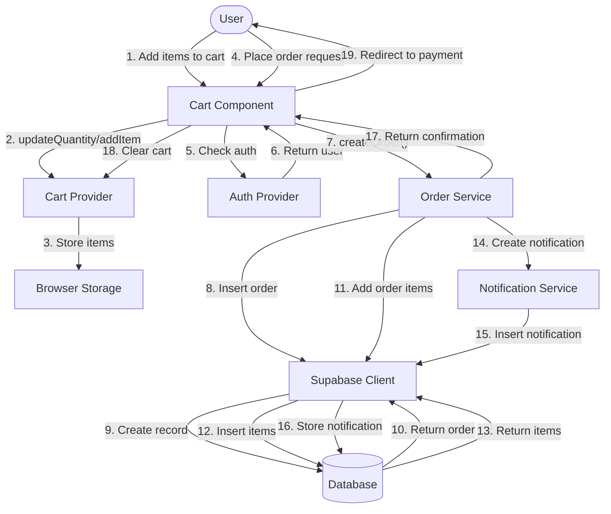

# Cart and Order Collaboration Diagram

```mermaid
graph TD
    User([User]) -- "1. Add items to cart" --> CartUI[Cart Component]
    CartUI -- "2. updateQuantity/addItem" --> CartProvider[Cart Provider]
    CartProvider -- "3. Store items" --> LocalStorage[Browser Storage]
    
    User -- "4. Place order request" --> CartUI
    CartUI -- "5. Check auth" --> AuthProvider[Auth Provider]
    AuthProvider -- "6. Return user" --> CartUI
    CartUI -- "7. createOrder()" --> OrderService[Order Service]
    OrderService -- "8. Insert order" --> Supabase[Supabase Client]
    Supabase -- "9. Create record" --> DB[(Database)]
    DB -- "10. Return order" --> Supabase
    
    OrderService -- "11. Add order items" --> Supabase
    Supabase -- "12. Insert items" --> DB
    DB -- "13. Return items" --> Supabase
    
    OrderService -- "14. Create notification" --> NotificationService[Notification Service]
    NotificationService -- "15. Insert notification" --> Supabase
    Supabase -- "16. Store notification" --> DB
    
    OrderService -- "17. Return confirmation" --> CartUI
    CartUI -- "18. Clear cart" --> CartProvider
    CartUI -- "19. Redirect to payment" --> User
```
