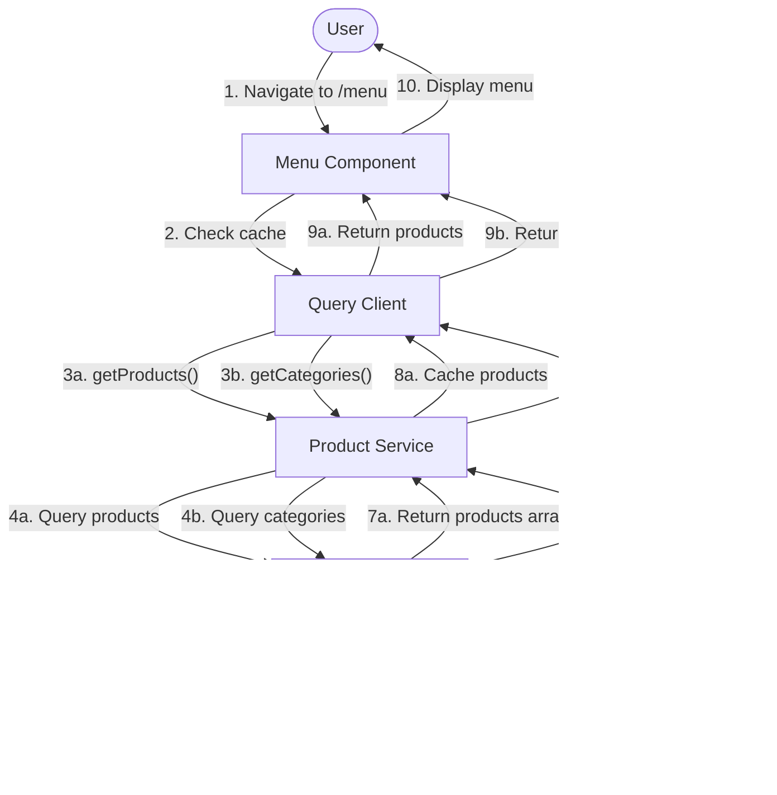

# View Menu Collaboration Diagram

```mermaid
graph TD
    User([User]) -- "1. Navigate to /menu" --> MenuUI[Menu Component]
    MenuUI -- "2. Check cache" --> QueryClient[Query Client]
    QueryClient -- "3a. getProducts()" --> ProductService[Product Service]
    ProductService -- "4a. Query products" --> Supabase[Supabase Client]
    Supabase -- "5a. SQL query" --> DB[(Database)]
    DB -- "6a. Return products" --> Supabase
    Supabase -- "7a. Return products array" --> ProductService
    ProductService -- "8a. Cache products" --> QueryClient
    QueryClient -- "9a. Return products" --> MenuUI
    
    QueryClient -- "3b. getCategories()" --> ProductService
    ProductService -- "4b. Query categories" --> Supabase
    Supabase -- "5b. SQL query" --> DB
    DB -- "6b. Return categories" --> Supabase
    Supabase -- "7b. Return categories" --> ProductService
    ProductService -- "8b. Cache categories" --> QueryClient
    QueryClient -- "9b. Return categories" --> MenuUI
    
    MenuUI -- "10. Display menu" --> User
```
