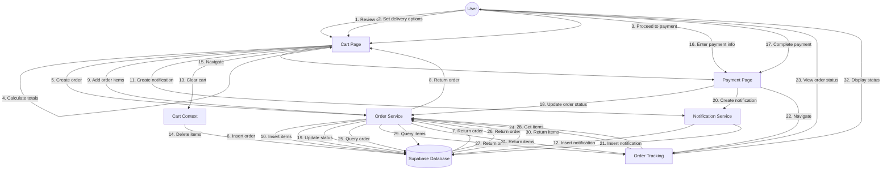

# Order Processing Collaboration Diagram

## Notes
- This diagram shows the complete order process from cart to tracking
- Numbered steps indicate the sequence of operations
- The process spans multiple pages: cart, payment, and tracking
- Database operations occur at each major step
- Notifications are created at key points in the process
