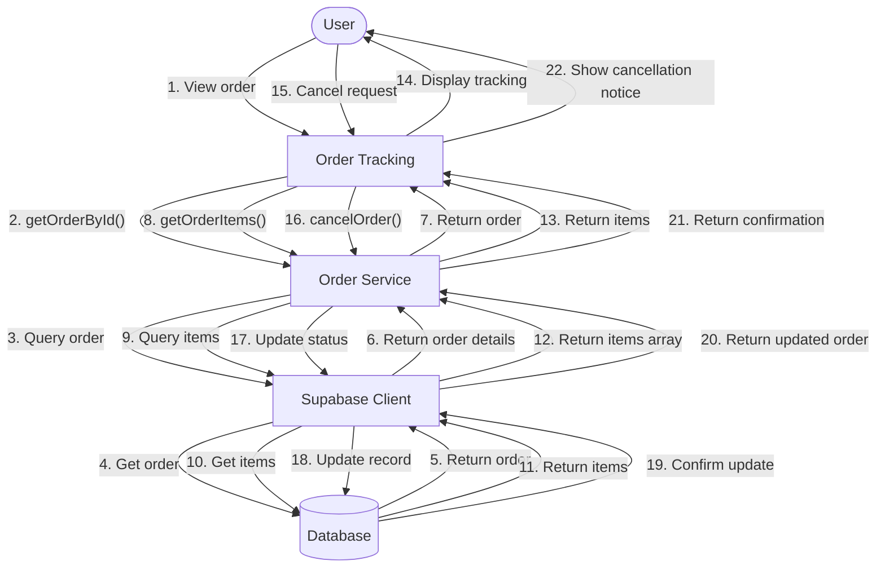

# Order Tracking Collaboration Diagram

```mermaid
graph TD
    User([User]) -- "1. View order" --> TrackingUI[Order Tracking]
    TrackingUI -- "2. getOrderById()" --> OrderService[Order Service]
    OrderService -- "3. Query order" --> Supabase[Supabase Client]
    Supabase -- "4. Get order" --> DB[(Database)]
    DB -- "5. Return order" --> Supabase
    Supabase -- "6. Return order details" --> OrderService
    OrderService -- "7. Return order" --> TrackingUI
    
    TrackingUI -- "8. getOrderItems()" --> OrderService
    OrderService -- "9. Query items" --> Supabase
    Supabase -- "10. Get items" --> DB
    DB -- "11. Return items" --> Supabase
    Supabase -- "12. Return items array" --> OrderService
    OrderService -- "13. Return items" --> TrackingUI
    
    TrackingUI -- "14. Display tracking" --> User
    
    User -- "15. Cancel request" --> TrackingUI
    TrackingUI -- "16. cancelOrder()" --> OrderService
    OrderService -- "17. Update status" --> Supabase
    Supabase -- "18. Update record" --> DB
    DB -- "19. Confirm update" --> Supabase
    Supabase -- "20. Return updated order" --> OrderService
    OrderService -- "21. Return confirmation" --> TrackingUI
    TrackingUI -- "22. Show cancellation notice" --> User
```
