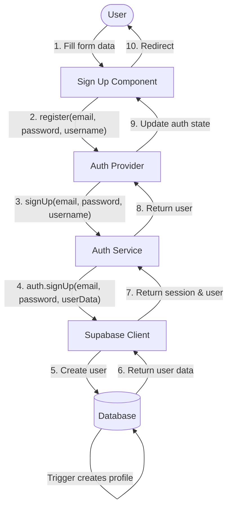

# Sign Up Collaboration Diagram

```mermaid
graph TD
    User([User]) -- "1. Fill form data" --> SignUpUI[Sign Up Component]
    SignUpUI -- "2. register(email, password, username)" --> AuthProvider[Auth Provider]
    AuthProvider -- "3. signUp(email, password, username)" --> AuthService[Auth Service]
    AuthService -- "4. auth.signUp(email, password, userData)" --> Supabase[Supabase Client]
    Supabase -- "5. Create user" --> DB[(Database)]
    DB -- "6. Return user data" --> Supabase
    Supabase -- "7. Return session & user" --> AuthService
    AuthService -- "8. Return user" --> AuthProvider
    AuthProvider -- "9. Update auth state" --> SignUpUI
    SignUpUI -- "10. Redirect" --> User
    DB -- "Trigger creates profile" --> DB
```
