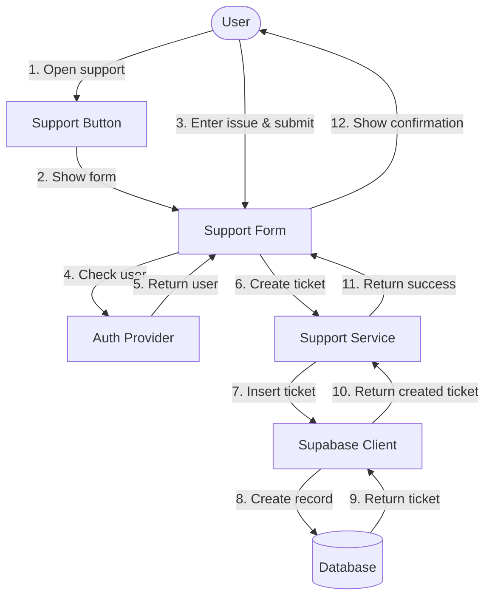

# Support Ticket Collaboration Diagram

```mermaid
graph TD
    User([User]) -- "1. Open support" --> SupportButton[Support Button]
    SupportButton -- "2. Show form" --> SupportForm[Support Form]
    User -- "3. Enter issue & submit" --> SupportForm
    SupportForm -- "4. Check user" --> AuthProvider[Auth Provider]
    AuthProvider -- "5. Return user" --> SupportForm
    SupportForm -- "6. Create ticket" --> SupportService[Support Service]
    SupportService -- "7. Insert ticket" --> Supabase[Supabase Client]
    Supabase -- "8. Create record" --> DB[(Database)]
    DB -- "9. Return ticket" --> Supabase
    Supabase -- "10. Return created ticket" --> SupportService
    SupportService -- "11. Return success" --> SupportForm
    SupportForm -- "12. Show confirmation" --> User
```
