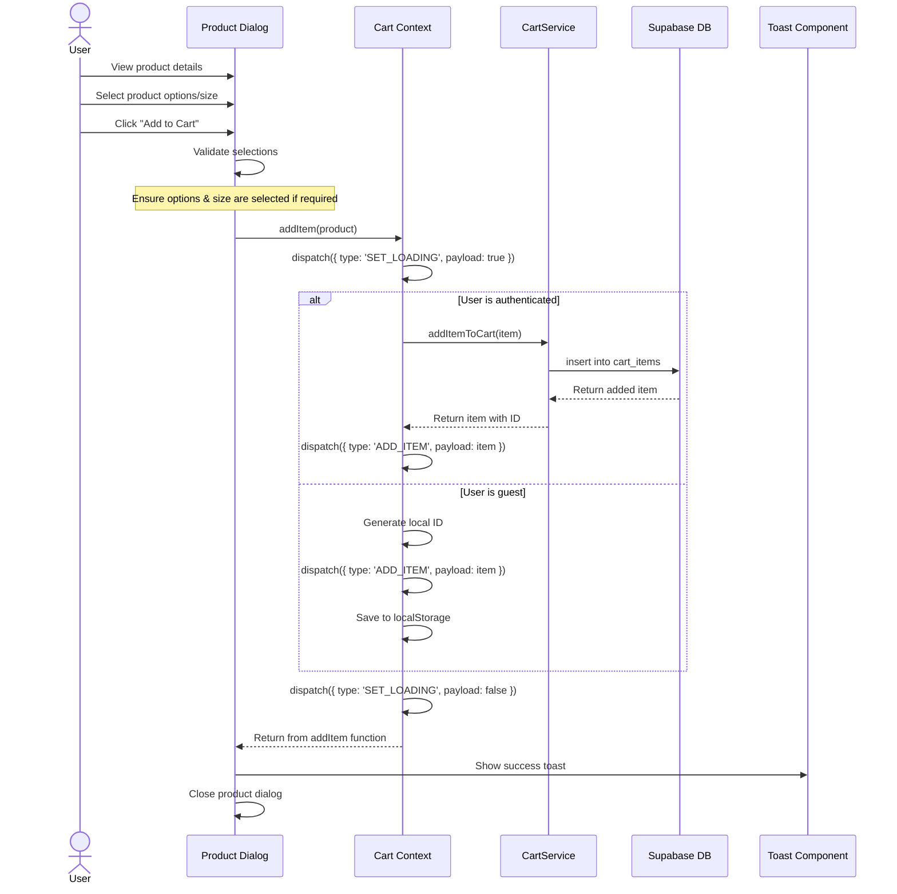

# Add to Cart Sequence Diagram

## Notes
- The diagram shows the process of adding a product to the cart
- Different paths are taken depending on whether the user is authenticated
- For logged-in users, the item is stored in the database
- For guest users, the cart is saved in localStorage
- Input validation ensures required selections are made
