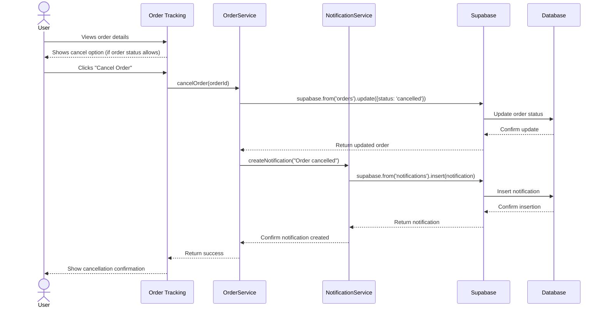

# Cancel Order Sequence Diagram

```mermaid
sequenceDiagram
    actor User
    participant UI as Order Tracking
    participant OrderService
    participant NotificationService
    participant Supabase
    participant DB as Database

    User->>UI: Views order details
    UI-->>User: Shows cancel option (if order status allows)
    User->>UI: Clicks "Cancel Order"
    UI->>OrderService: cancelOrder(orderId)
    OrderService->>Supabase: supabase.from('orders').update({status: 'cancelled'})
    Supabase->>DB: Update order status
    DB-->>Supabase: Confirm update
    Supabase-->>OrderService: Return updated order
    
    OrderService->>NotificationService: createNotification("Order cancelled")
    NotificationService->>Supabase: supabase.from('notifications').insert(notification)
    Supabase->>DB: Insert notification
    DB-->>Supabase: Confirm insertion
    Supabase-->>NotificationService: Return notification
    NotificationService-->>OrderService: Confirm notification created
    
    OrderService-->>UI: Return success
    UI-->>User: Show cancellation confirmation
```
