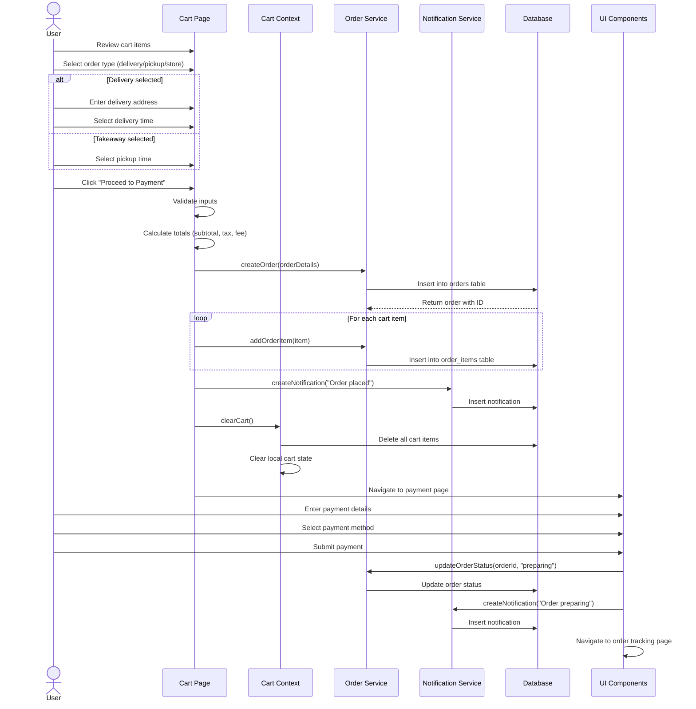

# Checkout Process Sequence Diagram

## Notes
- This diagram shows the full checkout flow from cart to payment completion
- The process includes order type selection with conditional fields
- Order creation occurs in the database before payment
- Cart items are converted to order items and saved
- Notifications are created at key points in the process
- The cart is cleared after successful order creation
