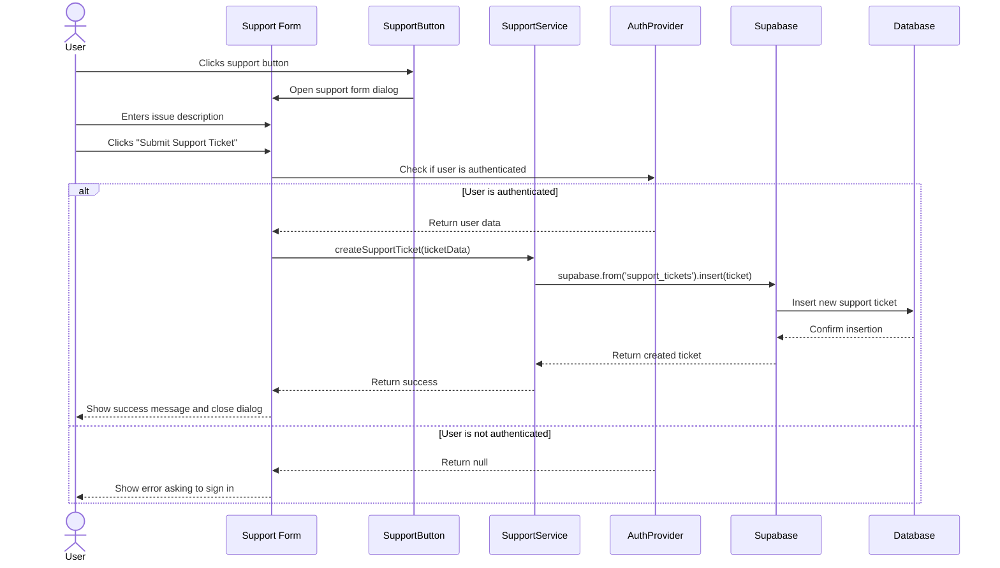

# Create Support Ticket Sequence Diagram

```mermaid
sequenceDiagram
    actor User
    participant UI as Support Form
    participant SupportButton
    participant SupportService
    participant AuthProvider
    participant Supabase
    participant DB as Database

    User->>SupportButton: Clicks support button
    SupportButton->>UI: Open support form dialog
    User->>UI: Enters issue description
    User->>UI: Clicks "Submit Support Ticket"

    UI->>AuthProvider: Check if user is authenticated
    alt User is authenticated
        AuthProvider-->>UI: Return user data
        UI->>SupportService: createSupportTicket(ticketData)
        SupportService->>Supabase: supabase.from('support_tickets').insert(ticket)
        Supabase->>DB: Insert new support ticket
        DB-->>Supabase: Confirm insertion
        Supabase-->>SupportService: Return created ticket
        SupportService-->>UI: Return success
        UI-->>User: Show success message and close dialog
    else User is not authenticated
        AuthProvider-->>UI: Return null
        UI-->>User: Show error asking to sign in
    end
```
