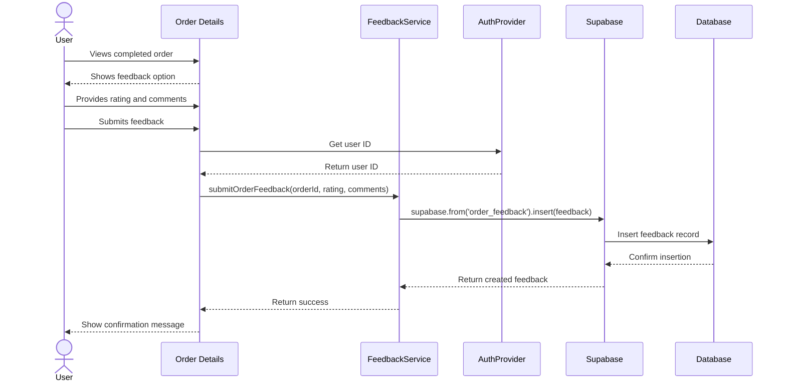

# Feedback Order Sequence Diagram

```mermaid
sequenceDiagram
    actor User
    participant UI as Order Details
    participant FeedbackService
    participant AuthProvider
    participant Supabase
    participant DB as Database

    User->>UI: Views completed order
    UI-->>User: Shows feedback option
    User->>UI: Provides rating and comments
    User->>UI: Submits feedback
    
    UI->>AuthProvider: Get user ID
    AuthProvider-->>UI: Return user ID
    
    UI->>FeedbackService: submitOrderFeedback(orderId, rating, comments)
    FeedbackService->>Supabase: supabase.from('order_feedback').insert(feedback)
    Supabase->>DB: Insert feedback record
    DB-->>Supabase: Confirm insertion
    Supabase-->>FeedbackService: Return created feedback
    FeedbackService-->>UI: Return success
    UI-->>User: Show confirmation message
```
