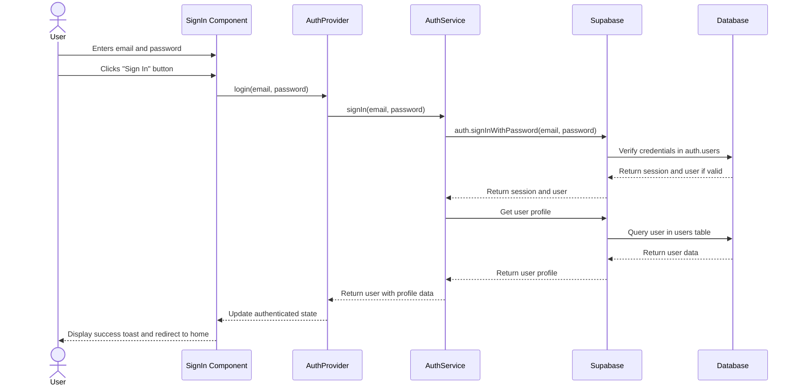

# Log In Sequence Diagram

```mermaid
sequenceDiagram
    actor User
    participant UI as SignIn Component
    participant AuthProvider
    participant AuthService
    participant Supabase
    participant DB as Database

    User->>UI: Enters email and password
    User->>UI: Clicks "Sign In" button
    UI->>AuthProvider: login(email, password)
    AuthProvider->>AuthService: signIn(email, password)
    AuthService->>Supabase: auth.signInWithPassword(email, password)
    Supabase->>DB: Verify credentials in auth.users
    DB-->>Supabase: Return session and user if valid
    Supabase-->>AuthService: Return session and user
    AuthService->>Supabase: Get user profile
    Supabase->>DB: Query user in users table
    DB-->>Supabase: Return user data
    Supabase-->>AuthService: Return user profile
    AuthService-->>AuthProvider: Return user with profile data
    AuthProvider-->>UI: Update authenticated state
    UI-->>User: Display success toast and redirect to home
```
