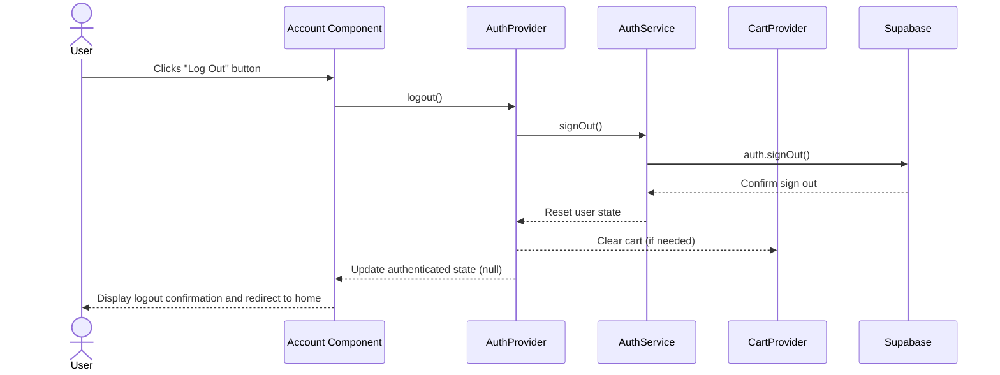

# Log Out Sequence Diagram

```mermaid
sequenceDiagram
    actor User
    participant UI as Account Component
    participant AuthProvider
    participant AuthService
    participant CartProvider
    participant Supabase

    User->>UI: Clicks "Log Out" button
    UI->>AuthProvider: logout()
    AuthProvider->>AuthService: signOut()
    AuthService->>Supabase: auth.signOut()
    Supabase-->>AuthService: Confirm sign out
    AuthService-->>AuthProvider: Reset user state
    AuthProvider-->>CartProvider: Clear cart (if needed)
    AuthProvider-->>UI: Update authenticated state (null)
    UI-->>User: Display logout confirmation and redirect to home
```
