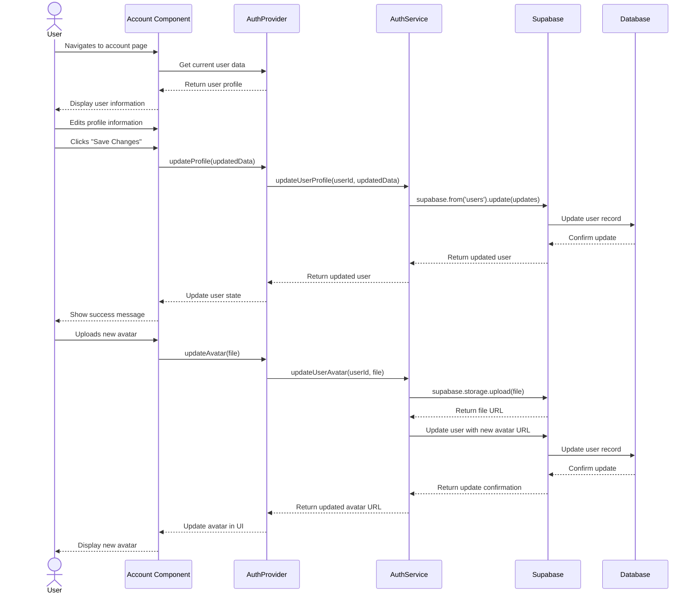

# Manage Personal Information Sequence Diagram

```mermaid
sequenceDiagram
    actor User
    participant UI as Account Component
    participant AuthProvider
    participant AuthService
    participant Supabase
    participant DB as Database

    %% View Profile
    User->>UI: Navigates to account page
    UI->>AuthProvider: Get current user data
    AuthProvider-->>UI: Return user profile
    UI-->>User: Display user information

    %% Update Profile
    User->>UI: Edits profile information
    User->>UI: Clicks "Save Changes"
    UI->>AuthProvider: updateProfile(updatedData)
    AuthProvider->>AuthService: updateUserProfile(userId, updatedData)
    AuthService->>Supabase: supabase.from('users').update(updates)
    Supabase->>DB: Update user record
    DB-->>Supabase: Confirm update
    Supabase-->>AuthService: Return updated user
    AuthService-->>AuthProvider: Return updated user
    AuthProvider-->>UI: Update user state
    UI-->>User: Show success message

    %% Update Avatar
    User->>UI: Uploads new avatar
    UI->>AuthProvider: updateAvatar(file)
    AuthProvider->>AuthService: updateUserAvatar(userId, file)
    AuthService->>Supabase: supabase.storage.upload(file)
    Supabase-->>AuthService: Return file URL
    AuthService->>Supabase: Update user with new avatar URL
    Supabase->>DB: Update user record
    DB-->>Supabase: Confirm update
    Supabase-->>AuthService: Return update confirmation
    AuthService-->>AuthProvider: Return updated avatar URL
    AuthProvider-->>UI: Update avatar in UI
    UI-->>User: Display new avatar
```
