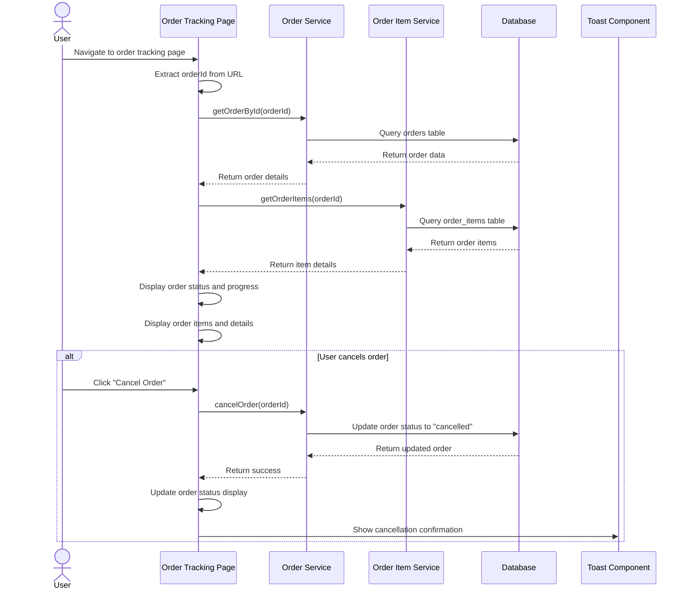

# Order Tracking Sequence Diagram

## Notes
- This diagram shows the process of tracking an order's status
- The order details and items are fetched separately
- Order status is displayed with a visual progress indicator
- Users can cancel their order if it's in an appropriate status
- The UI is updated immediately upon cancellation
