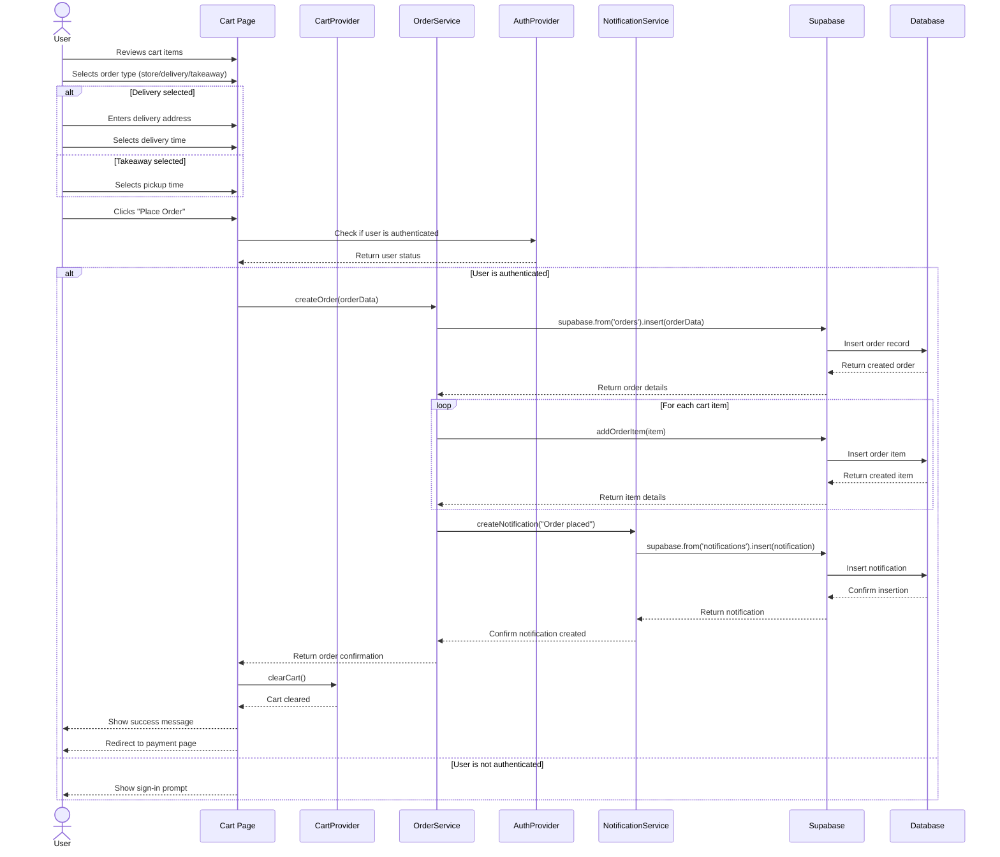

# Place Order Sequence Diagram

```mermaid
sequenceDiagram
    actor User
    participant Cart as Cart Page
    participant CartProvider
    participant OrderService
    participant AuthProvider
    participant NotificationService
    participant Supabase
    participant DB as Database

    User->>Cart: Reviews cart items
    User->>Cart: Selects order type (store/delivery/takeaway)
    alt Delivery selected
        User->>Cart: Enters delivery address
        User->>Cart: Selects delivery time
    else Takeaway selected
        User->>Cart: Selects pickup time
    end
    
    User->>Cart: Clicks "Place Order"
    Cart->>AuthProvider: Check if user is authenticated
    AuthProvider-->>Cart: Return user status
    
    alt User is authenticated
        Cart->>OrderService: createOrder(orderData)
        OrderService->>Supabase: supabase.from('orders').insert(orderData)
        Supabase->>DB: Insert order record
        DB-->>Supabase: Return created order
        Supabase-->>OrderService: Return order details
        
        loop For each cart item
            OrderService->>Supabase: addOrderItem(item)
            Supabase->>DB: Insert order item
            DB-->>Supabase: Return created item
            Supabase-->>OrderService: Return item details
        end
        
        OrderService->>NotificationService: createNotification("Order placed")
        NotificationService->>Supabase: supabase.from('notifications').insert(notification)
        Supabase->>DB: Insert notification
        DB-->>Supabase: Confirm insertion
        Supabase-->>NotificationService: Return notification
        NotificationService-->>OrderService: Confirm notification created
        
        OrderService-->>Cart: Return order confirmation
        Cart->>CartProvider: clearCart()
        CartProvider-->>Cart: Cart cleared
        Cart-->>User: Show success message
        Cart-->>User: Redirect to payment page
    else User is not authenticated
        Cart-->>User: Show sign-in prompt
    end
```
