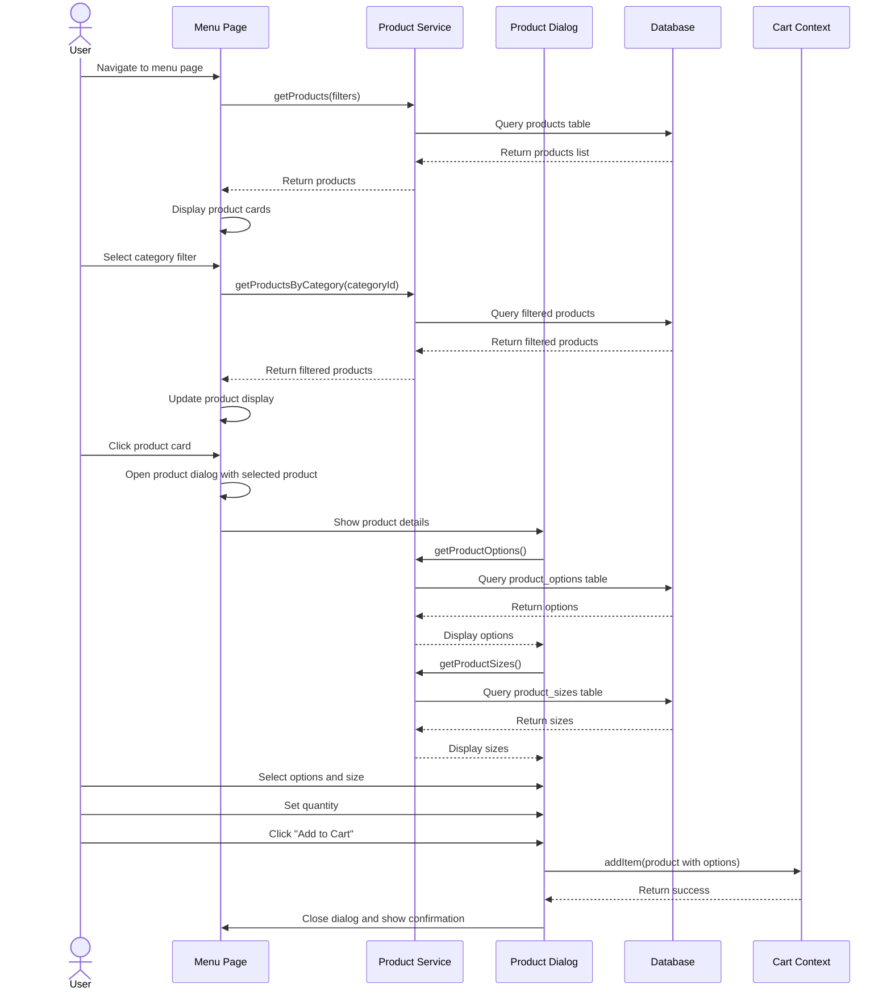

# Product Browsing Sequence Diagram

## Notes
- This diagram shows the user experience of browsing and selecting products
- Includes category filtering to find specific product types
- Detailed view shows product options and sizes
- Final step is adding the configured product to the cart
- The process is interactive with immediate UI updates
