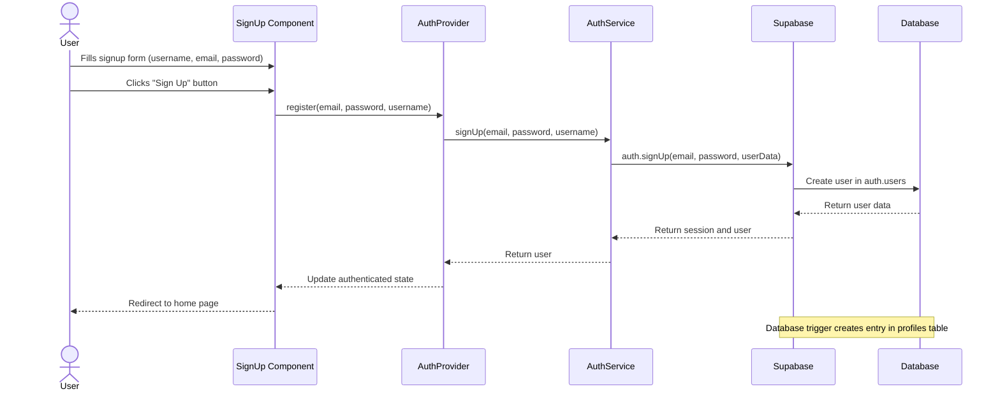

# Sign Up Sequence Diagram

```mermaid
sequenceDiagram
    actor User
    participant UI as SignUp Component
    participant AuthProvider
    participant AuthService
    participant Supabase
    participant DB as Database

    User->>UI: Fills signup form (username, email, password)
    User->>UI: Clicks "Sign Up" button
    UI->>AuthProvider: register(email, password, username)
    AuthProvider->>AuthService: signUp(email, password, username)
    AuthService->>Supabase: auth.signUp(email, password, userData)
    Supabase->>DB: Create user in auth.users
    DB-->>Supabase: Return user data
    Supabase-->>AuthService: Return session and user
    AuthService-->>AuthProvider: Return user
    AuthProvider-->>UI: Update authenticated state
    UI-->>User: Redirect to home page
    
    Note over Supabase,DB: Database trigger creates entry in profiles table
```
