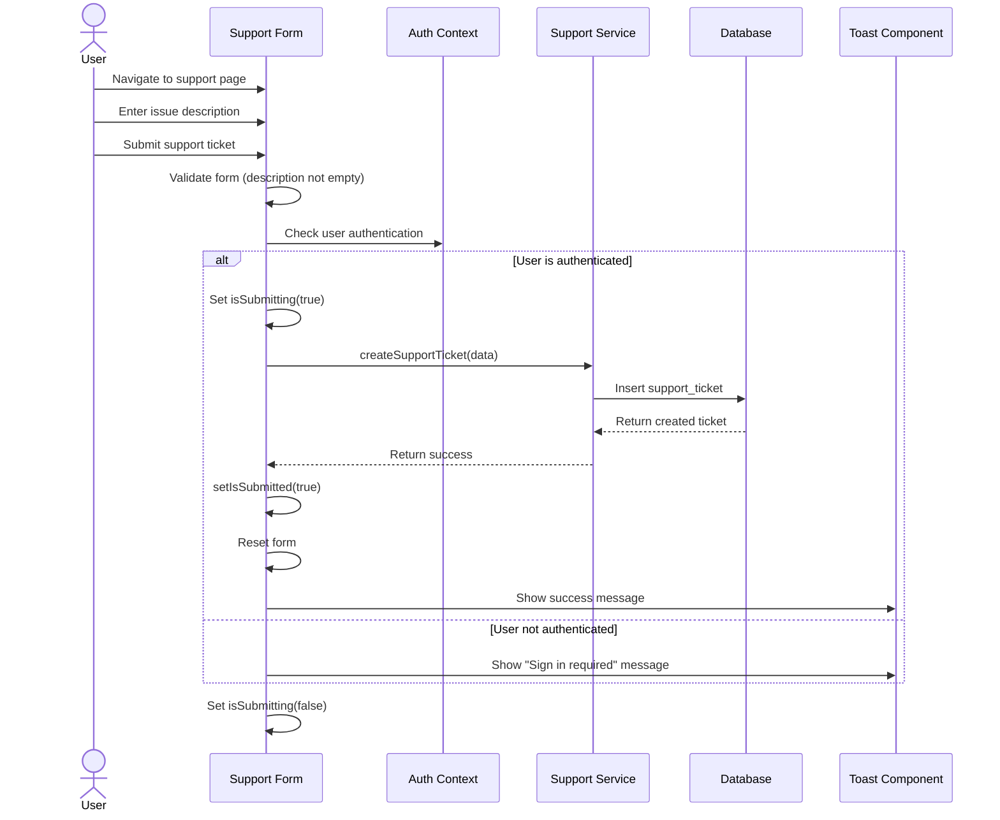

# Support Ticket Creation Sequence Diagram

## Notes
- The diagram shows the process of creating a support ticket
- Authentication check is performed before submission
- Form validation ensures the description is not empty
- Success state is shown after successful submission
- The form is reset for potential future submissions
