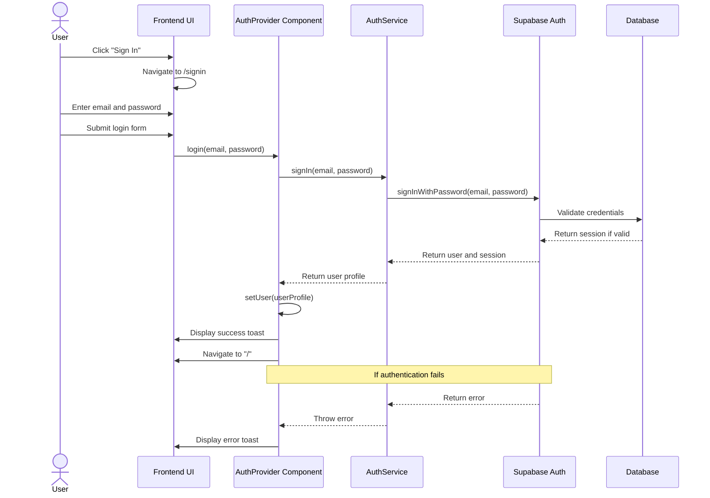

# User Authentication Sequence Diagram

## Notes
- The diagram shows the login process flow through the application layers
- Error handling occurs if credentials are invalid
- Upon successful login, the user is redirected to the home page
- The AuthProvider maintains the authentication state throughout the app
