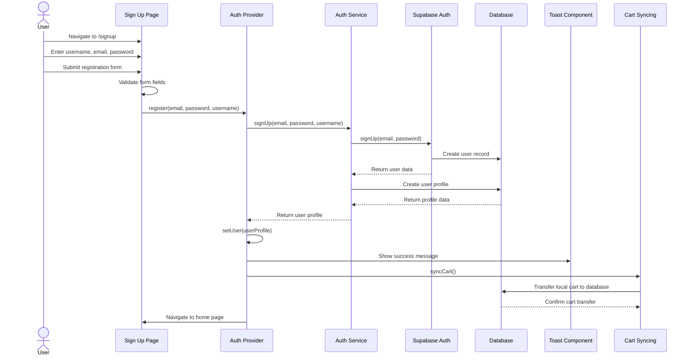

# User Registration Sequence Diagram

## Notes
- The diagram shows the user registration process
- Form validation occurs before submission
- User account is created in the auth system
- User profile is created in the database
- Cart items from localStorage are synced to the database
- User is redirected to the home page after successful registration
