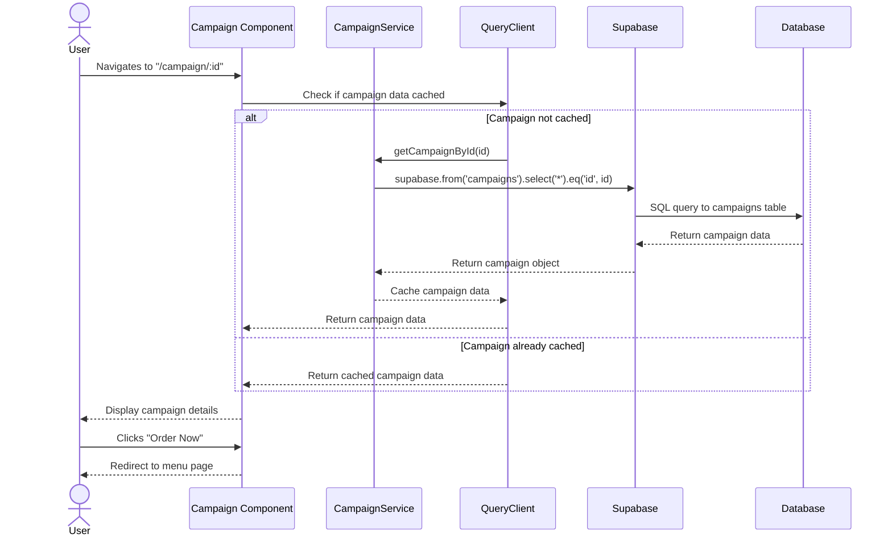

# View Campaign Sequence Diagram

```mermaid
sequenceDiagram
    actor User
    participant UI as Campaign Component
    participant CampaignService
    participant QueryClient
    participant Supabase
    participant DB as Database

    User->>UI: Navigates to "/campaign/:id"
    UI->>QueryClient: Check if campaign data cached
    alt Campaign not cached
        QueryClient->>CampaignService: getCampaignById(id)
        CampaignService->>Supabase: supabase.from('campaigns').select('*').eq('id', id)
        Supabase->>DB: SQL query to campaigns table
        DB-->>Supabase: Return campaign data
        Supabase-->>CampaignService: Return campaign object
        CampaignService-->>QueryClient: Cache campaign data
        QueryClient-->>UI: Return campaign data
    else Campaign already cached
        QueryClient-->>UI: Return cached campaign data
    end
    
    UI-->>User: Display campaign details
    
    User->>UI: Clicks "Order Now"
    UI-->>User: Redirect to menu page
```
