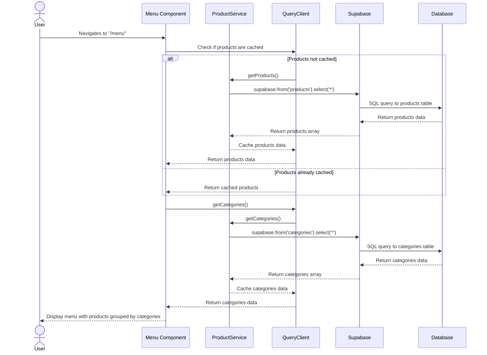

# View Menu Sequence Diagram

```mermaid
sequenceDiagram
    actor User
    participant UI as Menu Component
    participant ProductService
    participant QueryClient
    participant Supabase
    participant DB as Database

    User->>UI: Navigates to "/menu" 
    UI->>QueryClient: Check if products are cached
    alt Products not cached
        QueryClient->>ProductService: getProducts()
        ProductService->>Supabase: supabase.from('products').select('*')
        Supabase->>DB: SQL query to products table
        DB-->>Supabase: Return products data
        Supabase-->>ProductService: Return products array
        ProductService-->>QueryClient: Cache products data
        QueryClient-->>UI: Return products data
    else Products already cached
        QueryClient-->>UI: Return cached products
    end
    
    UI->>QueryClient: getCategories()
    QueryClient->>ProductService: getCategories()
    ProductService->>Supabase: supabase.from('categories').select('*')
    Supabase->>DB: SQL query to categories table
    DB-->>Supabase: Return categories data
    Supabase-->>ProductService: Return categories array
    ProductService-->>QueryClient: Cache categories data
    QueryClient-->>UI: Return categories data
    UI-->>User: Display menu with products grouped by categories
```
