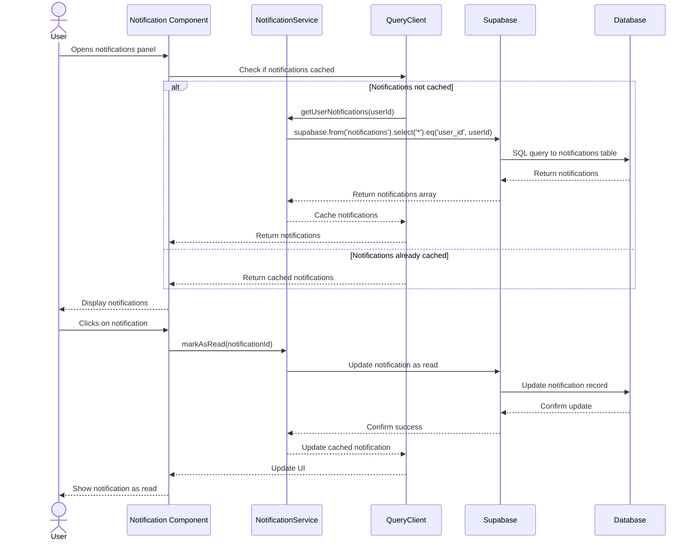

# View Notification Sequence Diagram

```mermaid
sequenceDiagram
    actor User
    participant UI as Notification Component
    participant NotificationService
    participant QueryClient
    participant Supabase
    participant DB as Database

    User->>UI: Opens notifications panel
    UI->>QueryClient: Check if notifications cached
    alt Notifications not cached
        QueryClient->>NotificationService: getUserNotifications(userId)
        NotificationService->>Supabase: supabase.from('notifications').select('*').eq('user_id', userId)
        Supabase->>DB: SQL query to notifications table
        DB-->>Supabase: Return notifications
        Supabase-->>NotificationService: Return notifications array
        NotificationService-->>QueryClient: Cache notifications
        QueryClient-->>UI: Return notifications
    else Notifications already cached
        QueryClient-->>UI: Return cached notifications
    end
    
    UI-->>User: Display notifications
    
    User->>UI: Clicks on notification
    UI->>NotificationService: markAsRead(notificationId)
    NotificationService->>Supabase: Update notification as read
    Supabase->>DB: Update notification record
    DB-->>Supabase: Confirm update
    Supabase-->>NotificationService: Confirm success
    NotificationService-->>QueryClient: Update cached notification
    QueryClient-->>UI: Update UI
    UI-->>User: Show notification as read
```
