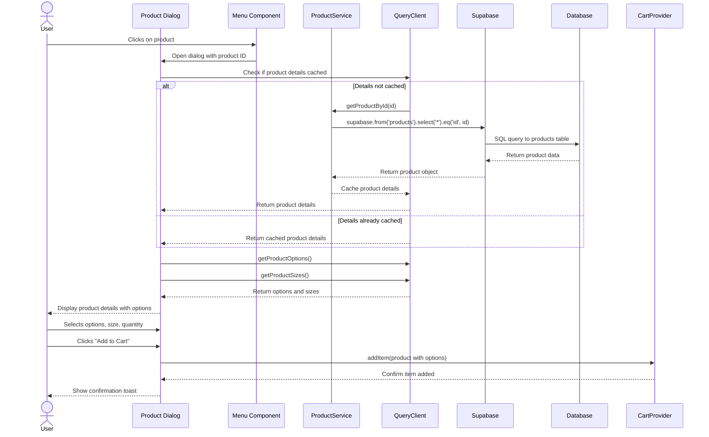

# View Product Details Sequence Diagram

```mermaid
sequenceDiagram
    actor User
    participant UI as Product Dialog
    participant Menu as Menu Component
    participant ProductService
    participant QueryClient
    participant Supabase
    participant DB as Database

    User->>Menu: Clicks on product
    Menu->>UI: Open dialog with product ID
    UI->>QueryClient: Check if product details cached
    alt Details not cached
        QueryClient->>ProductService: getProductById(id)
        ProductService->>Supabase: supabase.from('products').select('*').eq('id', id)
        Supabase->>DB: SQL query to products table
        DB-->>Supabase: Return product data
        Supabase-->>ProductService: Return product object
        ProductService-->>QueryClient: Cache product details
        QueryClient-->>UI: Return product details
    else Details already cached
        QueryClient-->>UI: Return cached product details
    end
    
    UI->>QueryClient: getProductOptions()
    UI->>QueryClient: getProductSizes()
    QueryClient-->>UI: Return options and sizes
    UI-->>User: Display product details with options
    
    User->>UI: Selects options, size, quantity
    User->>UI: Clicks "Add to Cart"
    UI->>CartProvider: addItem(product with options)
    CartProvider-->>UI: Confirm item added
    UI-->>User: Show confirmation toast
```
